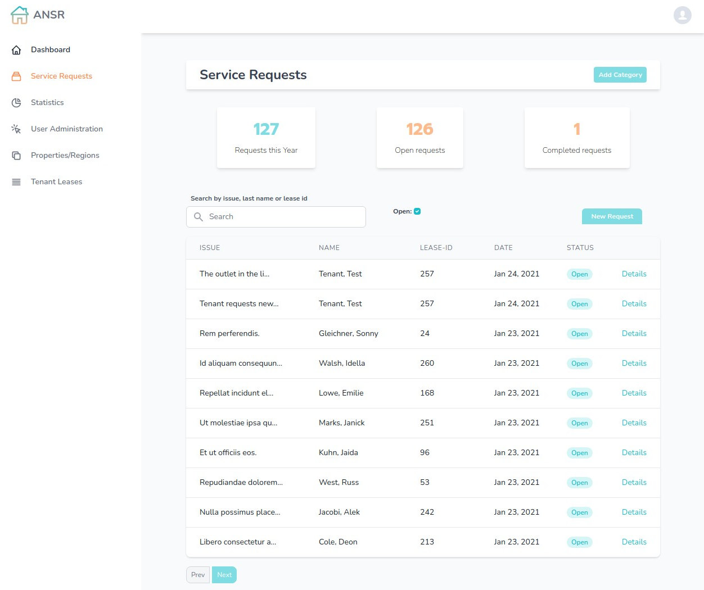

ANSR System
===========
ANSR system is a web application for property manangers to manage maintenance requests submitted
by tenants. Created using the TALL stack, Tailwind CSS, AlpineJS, Larvel and Livewire.

---

## Features
- Tenants can fill out a lease application
- When approved tenants can file service requests
- Employees section for managing service requests
- Work orders and details can be created and managed
- File upload support for the above
- Properties can be created and associated with regions
- New tenants and employees can be created by management

---

## Service Request Index

---

## Work Detail with File Upload

---

### Employees can have one of 3 roles
- **Management:** Can create leases, add properties, edit users and has access to all regions.
- **Administrative:** Only has access to the region they belong to, can do all the above except user manangement.
- **Administrative:** Has access to service requests and work orders. Can only edit certain properties related to role.

